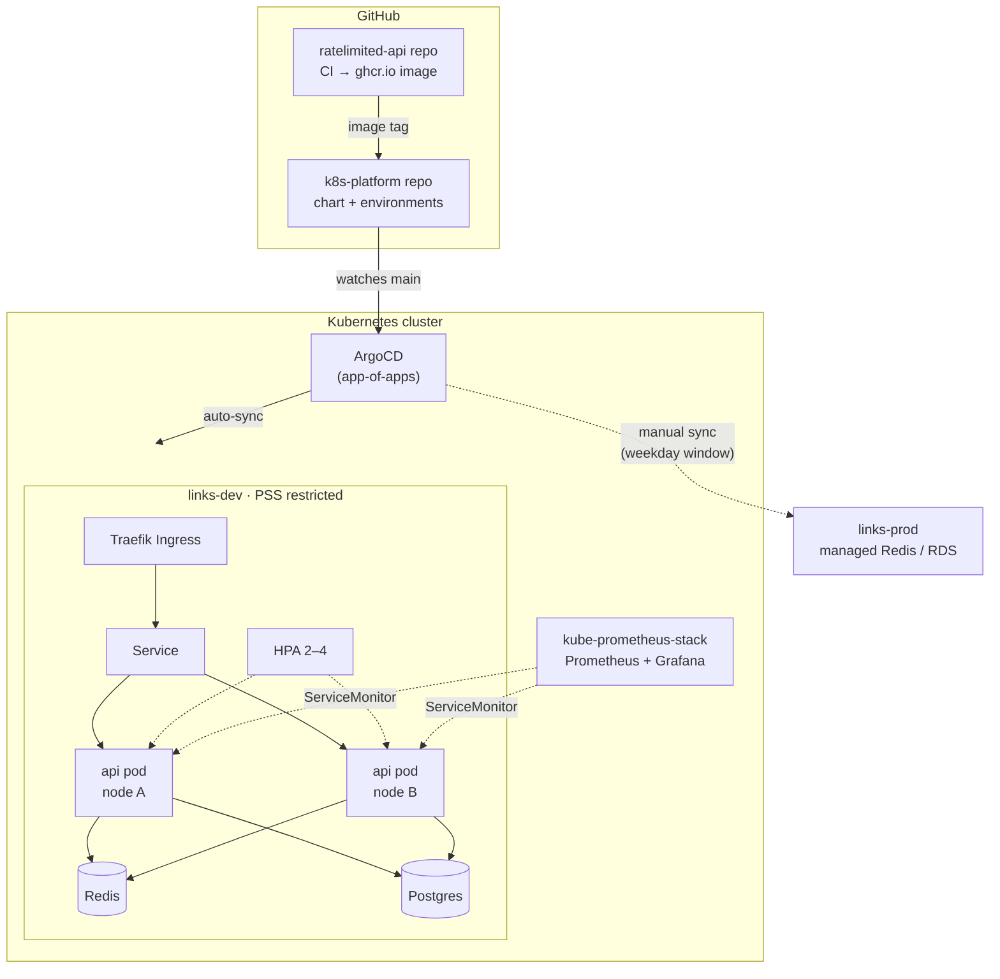

# k8s-platform

[](https://github.com/Salar24/k8s-platform/actions/workflows/ci.yml)


The Kubernetes deployment for [**ratelimited-api**](https://github.com/Salar24/ratelimited-api): a production-style Helm chart, GitOps with ArgoCD across dev and prod, cluster add-ons (Traefik, Prometheus and Grafana), and an **end-to-end suite that tests the running system on a real multi-node cluster** in CI.

The app code and its deployment config live in separate repos, as is common in GitOps: the app repo publishes an image, and this repo decides which image runs where. The AWS infrastructure behind the **prod** environment (EKS, RDS, ElastiCache) is in [**terraform-aws-platform**](https://github.com/Salar24/terraform-aws-platform).

## What CI proves on every commit

Each push spins up a 3-node [kind](https://kind.sigs.k8s.io/) cluster, installs the chart and runs [`scripts/e2e.sh`](scripts/e2e.sh):

| Check | How | Latest result |
|---|---|---|
| Hardened pods | Install into a namespace enforcing the **`restricted` Pod Security Standard** | ✅ |
| Chart works | `helm test` creates a link, follows the redirect, checks rate-limit headers | ✅ |
| **Rate limit is shared across replicas** | 30 requests from one client; one Redis bucket should allow 9 (independent per-pod buckets would allow ~19) | ✅ 9 allowed / 21 limited |
| Load balancing | Each API pod's logs show it received traffic | ✅ both pods served traffic |
| Network isolation | A non-API pod tries to reach Redis and must be blocked by NetworkPolicy | ✅ blocked |
| **Zero-downtime deploys** | Rolling restart while ~125 req/s hit the service | ✅ 5,107 requests, 0 failed |
| Node fault tolerance | After the rollout, API replicas must be on different nodes | ✅ 2 pods / 2 nodes |

Static checks run first: `helm lint --strict` and [kubeconform](https://github.com/yannh/kubeconform) schema validation, including CRDs, for every environment and for the ArgoCD manifests.

## Architecture



## Repository layout

```
charts/ratelimited-api/   Helm chart
  templates/
    deployment.yaml       API: probes, preStop drain, topology spread, hardened securityContext
    api-resources.yaml    Service, ServiceAccount, HPA, PDB, Ingress
    redis.yaml            optional in-cluster Redis (dev/test)
    postgres.yaml         optional in-cluster Postgres StatefulSet (dev/test)
    networkpolicy.yaml    only the API may reach Redis/Postgres
    monitoring.yaml       ServiceMonitor + Grafana dashboard ConfigMap
    tests/                helm test smoke test
environments/
  dev/values.yaml         in-cluster dependencies, auto-synced
  prod/values.yaml        stateless pods, managed Redis/Postgres, TLS, 3–20 replicas
argocd/
  root.yaml               app-of-apps entry point (the only thing applied by hand)
  apps/                   AppProject, API apps (dev/prod), Traefik, kube-prometheus-stack
kind/cluster.yaml         1 control plane + 2 workers
scripts/e2e.sh            end-to-end checks (runs against any kubectl context)
```

## Design decisions

**Reliability**
- **Rollouts never drop traffic.** `maxUnavailable: 0`, a readiness probe that checks the database, and a `preStop` sleep so endpoints are removed before the process stops accepting connections. The e2e suite checks this under load.
- **Replicas never share a node** in dev or prod: `topologySpreadConstraints` with `DoNotSchedule`. The first CI run caught both pods landing on one node after a restart, for two reasons. The tainted control-plane node counted as an empty zone (fixed with `nodeTaintsPolicy: Honor`), and the old ReplicaSet's pods skewed placement (fixed with `matchLabelKeys: [pod-template-hash]`).
- **PodDisruptionBudget** keeps at least 1 pod (2 in prod) available through node drains and upgrades.
- **HPA** scales up quickly (it can double every 30s) and down slowly (one pod per minute after a 5-minute window) to avoid flapping. ArgoCD ignores `spec.replicas`, so it doesn't fight the autoscaler.

**Security**
- Every container, including Redis, Postgres and the test pod, runs **non-root with a read-only root filesystem, all capabilities dropped and the `RuntimeDefault` seccomp profile**, so it passes the `restricted` Pod Security Standard.
- **Default-deny networking toward data stores:** only API pods can connect to Redis on 6379 and Postgres on 5432.
- **No secrets in Git for prod.** Prod reads `DATABASE_URL` from a Secret managed by External Secrets. Dev uses an in-cluster database that only the API can reach.
- Service account tokens are not mounted, because the API never talks to the Kubernetes API.

**GitOps**
- **App-of-apps:** applying `argocd/root.yaml` once bootstraps everything. Sync waves order the rollout: project first, then add-ons, then apps.
- **Dev auto-syncs** with prune and self-heal. **Prod needs a manual sync** and is limited to a weekday sync window by the AppProject.
- **Images are pinned to commit SHAs**, not `latest`, so every deploy is reproducible and easy to roll back with `git revert`.

## Run it locally

Prerequisites: Docker, [kind](https://kind.sigs.k8s.io/), kubectl, Helm.

```bash
kind create cluster --config kind/cluster.yaml
bash scripts/e2e.sh                  # install + run all checks

kubectl -n links-e2e port-forward svc/ratelimited-api 8080:80
curl -X POST localhost:8080/api/v1/links -d '{"url":"https://go.dev","code":"golang"}'
```

### Full GitOps setup

```bash
kubectl create namespace argocd
kubectl apply -n argocd --server-side -f https://raw.githubusercontent.com/argoproj/argo-cd/stable/manifests/install.yaml
kubectl apply -n argocd -f argocd/root.yaml
# ArgoCD now installs Traefik, kube-prometheus-stack and the dev app from Git.
```

## Promoting a release

1. ratelimited-api CI publishes `ghcr.io/salar24/ratelimited-api:<sha>`.
2. Open a PR here bumping `image.tag` in `environments/dev/values.yaml`. CI validates it.
3. Merge; ArgoCD rolls dev automatically.
4. Bump `environments/prod/values.yaml`, merge, and sync prod from ArgoCD during the window.
